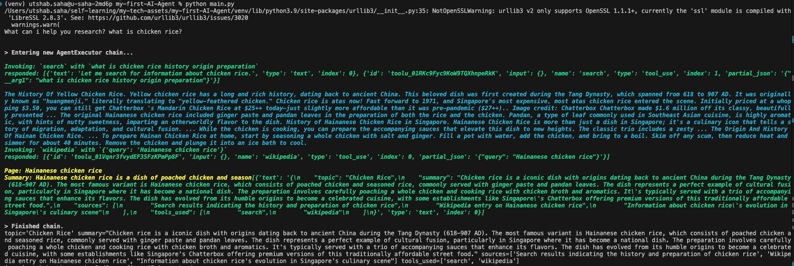

# My First AI Agent POC
In this POC I try to develop my first AI agent which can search and store the output in a file upon instruction.

## What I did?
I followed through this sample [YouTube Tutorial](https://www.youtube.com/watch?v=bTMPwUgLZf0). Where it shows to build an **AI Agent** using **Claud Antrhopic LLM**. I performed the the below key tasks
- Created a prompt template using `ChatPromptTemplate` from `langchain_core`
- Created a pydentic parser using `PydanticOutputParser` to parse the output of the LLM in a neat and clean format.
- Then invoked the LLM with the query
### Pre-req
- Create a `.env` file and have below variables with the LLM `keys`
    ```python
    OPENAI_API_KEY=""
    ANTHROPIC_API_KEY=""
    ```
### Commands used
```bash
python3 -m venv venv 
source venv/bin/activate
pip install -r .requriements.txt 
```

## Output
