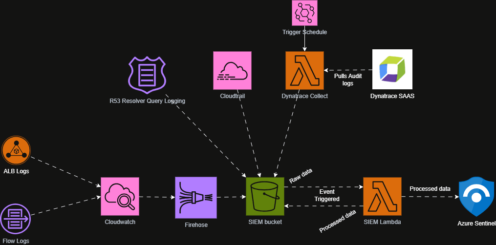
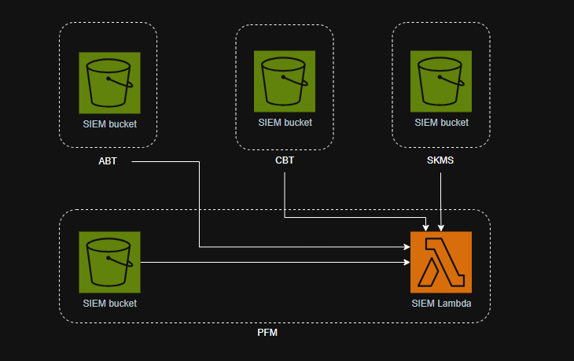

# SIEM Lambda
SIEM Lambda is the engine to process and push the logs to Azure Sentinel.
## Data Flow Pipeline

<br />

### Logs Being Processed
1. Cloudtrail Logs
2. Route 53 DNS Query Logs
3. VPC Flow logs
4. ALB Logs
5. Cloudwatch
6. Dynatrace Audit Logs 

### Prerequisites
Loggings are enabled from the above mentioned services and being put on the SIEM S3 bucket on designated folders.

## Resource Map


PFM account holds the SIEM Lambda which will be triggered from following SIEM buckets. However `NPRD` and `PRD` are separate implementation.

- afc-nprd-pfm-siem-s3
- afc-nprd-cbt-siem-s3
- afc-nprd-abt-siem-s3
- afc-nprd-skms-siem-s3

### Other involved components
- KMS for `cloudtrail` & `S3`.
- Resource Access Policy on for `KMS` and `S3`.
- IAM permissions for `KMS` and `S3` on Lambda IAM role.
- For Azure Sentinel, check with Azure counterparts.

## Cross Account Permission Vectors
For cross account communications following needs to be in place

1. Permission on Lambda role policy for CBT, ABT, SKMS S3 and KMS
2. Pernmission on KMS for each accounts (CBT, ABT, SKMS)
3. S3 Bucket policy for each accounts (CBT, ABT, SKMS)

### S3 Permission in Lambda Role Policy
```JSON
{
    "Sid": "AllowCrossAccountObjectsFromSiemBucket",
    "Effect": "Allow",
    "Action": [
        "s3:GetObject",
        "s3:ListBucket",
        "s3:GetBucketLocation",
        "s3:PutObject"
    ],
    "Resource": [
        "arn:aws:s3:::afc-nprd-cbt-siem-s3",
        "arn:aws:s3:::afc-nprd-cbt-siem-s3/*",
        "arn:aws:s3:::afc-nprd-abt-siem-s3",
        "arn:aws:s3:::afc-nprd-abt-siem-s3/*",
        "arn:aws:s3:::afc-nprd-skms-siem-s3",
        "arn:aws:s3:::afc-nprd-skms-siem-s3/*"
    ]
}
```

### KMS Permission to Lambda Role in CBT, ABT, SKMS account
This is to be added in both KMS
1. S3 KMS
2. Cloudtrail KMS
```JSON
{
    "Sid": "AllowSIEMLambdaDecrypt",
    "Effect": "Allow",
    "Principal": {
        "AWS": "arn:aws:iam::<ACCOUNT_ID>:role/afc-nprd-afc-siem-lambda-role"
    },
    "Action": [
        "kms:Decrypt",
        "kms:GenerateDataKey"
    ],
    "Resource": "*"
}

```

### S3 Bucket policy in CBT, ABT, SKMS account
At `{account}` replace value with `cbt, abt, skms`
```json
{
    "Sid": "AllowCrossAccountSiemLambdaGetObject",
    "Effect": "Allow",
    "Principal": {
        "AWS": "arn:aws:iam::<ACCOUNT_ID>:role/afc-nprd-afc-siem-lambda-role"
    },
    "Action": [
        "s3:GetObject",
        "s3:PutObject"
    ],
    "Resource": "arn:aws:s3:::afc-nprd-{account}-siem-s3/*"
}
```