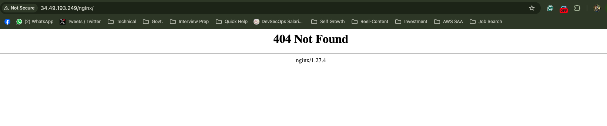
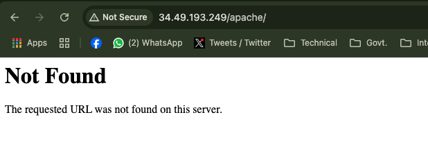
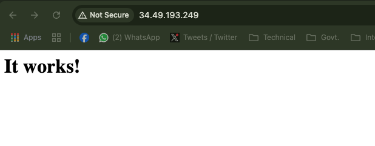
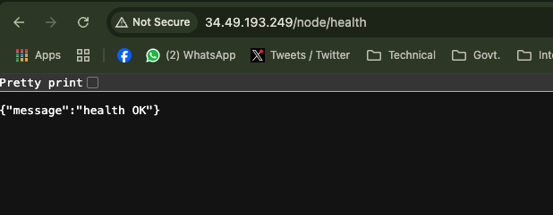
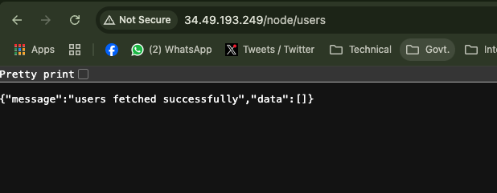

# Description
In this POC I triage for serving multiple backends (Nginx, Apache, a small Node API) with a single `Ingress`.  
This POC is done on `GKE` cluster.
## Idea
The idea is such that I shall have **3 different routes** to route traffics to desired backends.  
- `/nginx/` for Nginx traffic
- `/apache/` for Apache traffic
- `/node/` for Node API traffic
## Behaviour Description
### Nginx

<br>
The Nginx is serving `404 Not Found` because I only deployed the default `Nginx` docker image straight from `dockerhub.io`. Hence the container inside the pod do not have any resource in `/nginx/` path. Rather it would have served the default page in `/` but I do not have the ingress path for `/`

### Apache

<br>
This is also same as `Nginx`. It does not have any resource to serve for path `/apache/`.

### Apache as Default Backend
As we looked both `Nginx` and `Apache` cannot serve *ingress path* `/nginx/` and `/apache/` since they do not have any resource.
<br>
But I have set `Apache` backend as the default backend in `ingress.yml`. Hence for `/` path after the `Ingress IP` it serves from *default backend*, `Apache` in this case.
<br>


## Node API App


<br>
In above screen shots we can see both endpoints `/node/health` and `/node/users` are being served from `Node App` backend.

## Additional Note
Below commands are to resolve an ad-hoc issue occured due to building the docker image in **M2 Macbook Pro**. Which yeilds `arm64` architecture docker images which did not supported in my **GKE cluster** which only suppored `amd64` architecture. Hence using below commands I was able to build `multi` architecture image.
### Commands
```bash
docker buildx create --use
docker buildx build --platform linux/amd64,linux/arm64 -t utssaha/node-app:v3 --push .
```