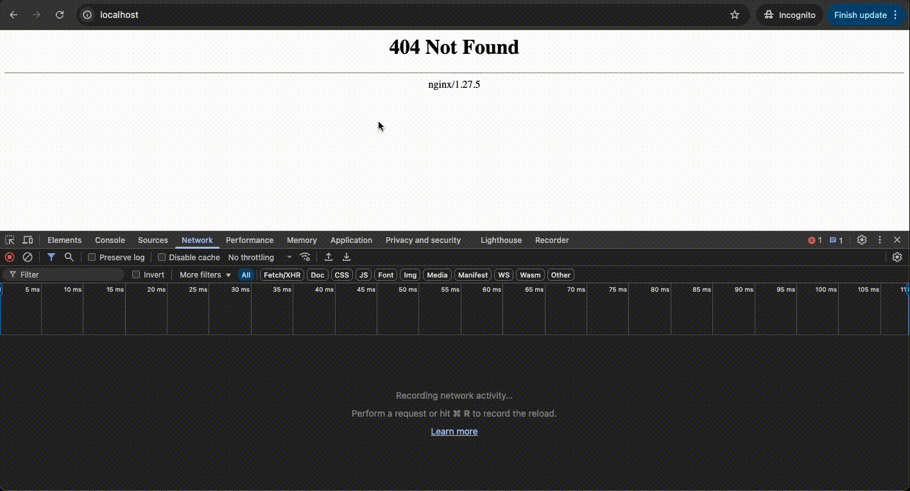

# Description
Here I solve an issue of [streamlit](https://https://streamlit.io/) a light weight Python framework which helps to develop frontend UI quickly mostly for **Data Science Projects**.

# Issue
The issue is such that whenevenr the **streamlit app** is served on **some containerised cloud environment (ECS, EKS, GKE)** the page gets refreshed after **30 seconds**. I managed to reproduce the same in local system.


# What is actually happening?
The reason, that I managed to reproduce the issue in local system is because its not technically a cloud environment issue but a fundamental fact of the **streamlit** framework, the way it works.
<br />
<br />
**Streamlit** heavily relies on `Websockets` for realtime data representations as it is more dedicated to *Data Science Projects*. And *refresh* issue appears when the **streamlit app** is fronted with a Proxy (Loadbalancers, K8 Ingress).
<br />
<br />
It is my understanding that such cloud proxy services are configured with default HTTP header handling capabilites, which does not include **Websocket header handling**. Hence the proxy fails to verify it's `health` status if the `Websocket` headers are not handled properly and keeps **restarting the steamlit service**.

# Solution
To reproduce the same I deployed the **streamlit app** container with a **squid-proxy** and it started to behave the same as it would do in cloud environments.
## How did I solve?
As mentioned before I handled the `Websocket` headers in *proxy config (nginx.conf)* with below attributes
```nginx
proxy_http_version 1.1;
proxy_set_header Upgrade $http_upgrade;
proxy_set_header Connection "upgrade";
```

